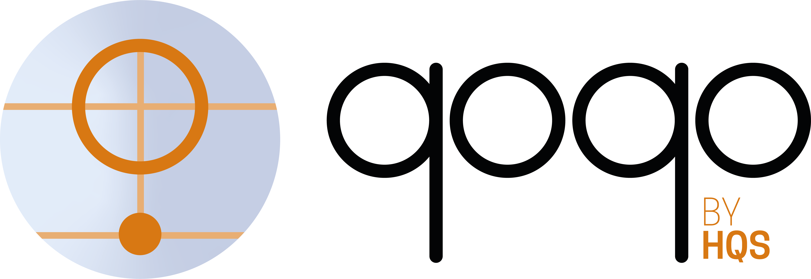

# qoqo-qasm interface

Qasm interface for the qoqo quantum toolkit by [HQS Quantum Simulations](https://quantumsimulations.de).

qoqo-qasm provides the QasmBackend class that allows users translate a qoqo circuit into a qasm file.
Not all qoqo operations have a corresponding qasm expression.  
Circuits containing operations without a corresponding expression can not be translated.

This software is still in the beta stage. Functions and documentation are not yet complete and breaking changes can occur.
